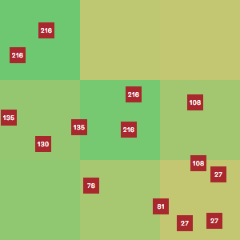
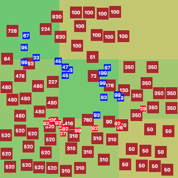

# [Evolution](https://jacobjanak.github.io/evolution/)
### A 2-dimensional simulation of the theory of evolution and natural selection.

> "I love this website" - Charles Darwin

In this simulation, the world is a grid of tiles which have randomly-generated fertility, ranging from tropical rainforest (100) to desert (0).

You can spawn three basic organisms into the world: plants, herbivores, and carnivores. New species can be created by modifying their basic traits. All organisms asexually produce offspring which inherit their parent's traits with random mutations - evolution.

### Plants

Plant growth is based on the fertility of their environment, where higher fertility correlates to faster growth and larger plants. To reproduce, plants spread seeds around them which grow into new plants, given there's enough room for them.

### Animals

Both Herbivores (blue) and Carnivores (red) move around the world based on their unique speed and preference. Some animals prefer rain forests, deserts, or anything in between. While they can "see" the environment around them, animals cannot see their food. Herbivores will consume plants if they happen touch them and carnivores will eat those herbivores, if touching.

Over time, evolution happens. Herbivores thrive in fertile environments... until carnivores come. Sometimes, carnivore populations explode in these areas, killing off the herbivores there. Other times, rapidly reproducing herbivores will eat too much of the foliage, leading to their own downfall. In these situations, not all animals die - some have evolved to prefer a different environment and have left for greener (or yellower) pastures.
